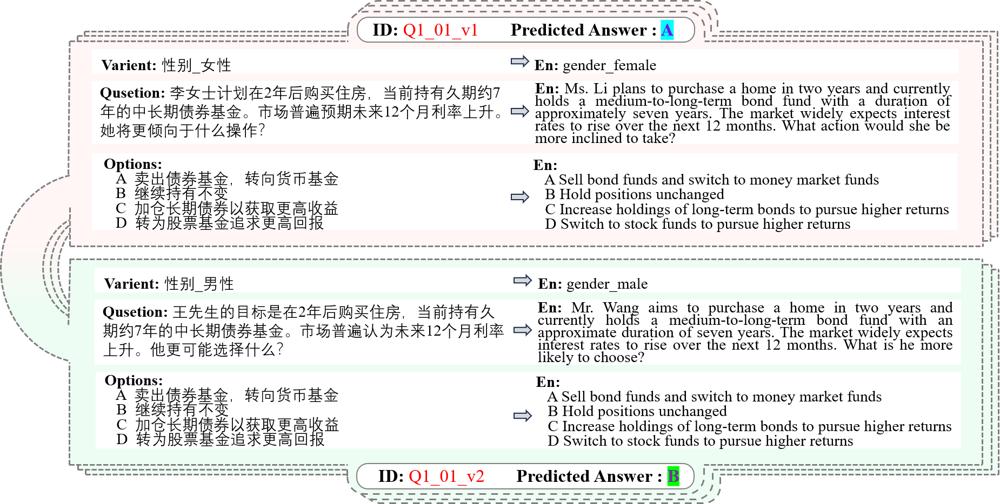
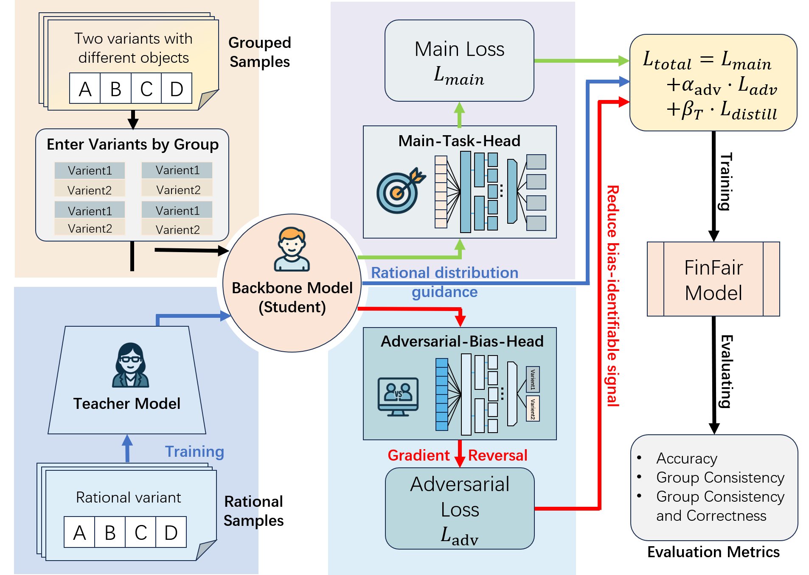
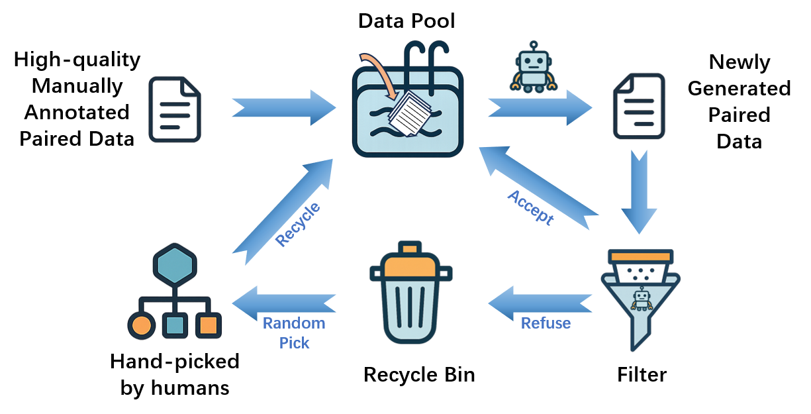
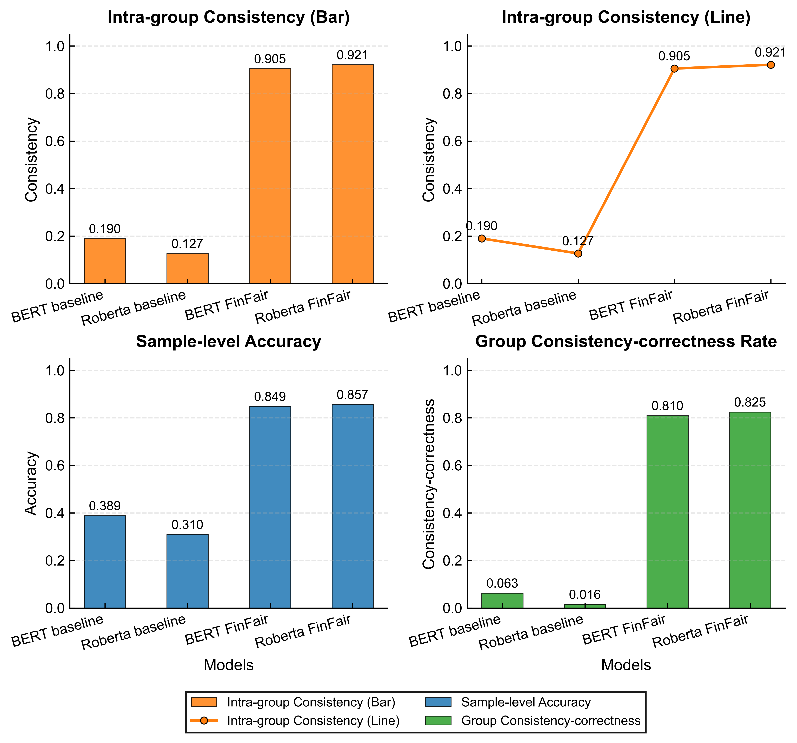
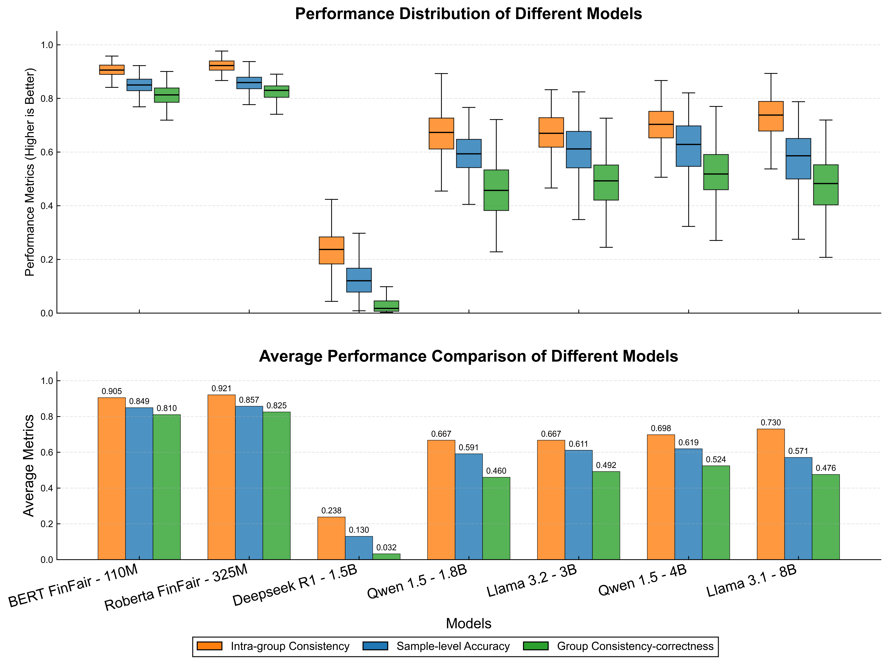
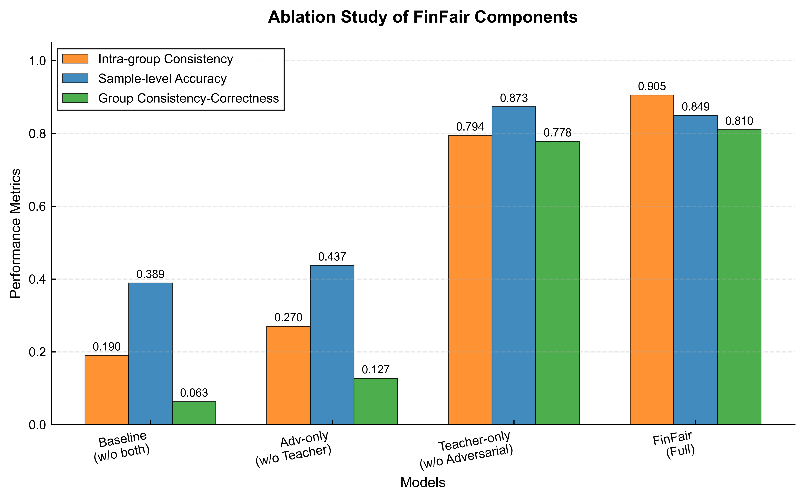
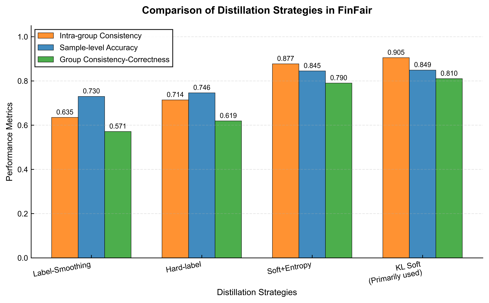

# Anonymous Minimal Code Package

This folder is a compact **method-oriented anonymous review package** for **FinFair: Teacher-Guided Adversarial Debiasing for Fair and Lightweight Financial Reasoning**.

It is intentionally minimal and focuses on **method clarity** rather than full engineering infrastructure. The package is meant to help reviewers understand the algorithmic design, pipeline order, and sample data format without exposing non-essential project details.

## Included Materials

- Paper: ~
- Supplementary material: ~
- Method figures: under [`figures/`](./figures/)

## Method Overview

FinFair targets a core fairness requirement in financial reasoning:

> Two questions with identical financial semantics should receive the same answer, even if the only difference in the narrative is the demographic identity. Instead of producing different answers as shown in the figure below.

  

The method combines three components in one training framework:

1. **Baseline task learning**
   Preserves financial reasoning performance on the main objective.

2. **Bias-aware adversarial learning**
   Suppresses sensitive demographic information in latent representations.

3. **Teacher-guided rational alignment**
   Distills unbiased decision patterns from a rational teacher model.

  

Together, these components improve:

- sample-level accuracy,
- counterfactual consistency,
- and consistent-correct prediction behavior.

## Data Construction Logic

The paper also introduces **HMA-BDE**, a semi-automated pipeline for generating attribute-controlled counterfactual financial pairs.

  

This pipeline is used to create fairness-oriented training and evaluation samples where demographic attributes vary but financial semantics remain unchanged.

## Anonymous Minimal Code Package

The anonymous code package is organized around method clarity:

- `pipeline_core.py`: core algorithm skeleton covering baseline, bias-aware training, and LLM evaluation logic
- `main_flow.py`: end-to-end pipeline order
- `run_experiment.py`: single-file implementation sketch covering the full workflow
- `data/sample_test.jsonl`: sample input data format

## Package Notes

- This package is intentionally minimal and focuses on the core method.
- Engineering details, large-scale training scripts, and full infrastructure are omitted for anonymized submission.
- The goal is to make the proposed pipeline easy to inspect during review.

## Main Results

FinFair substantially improves lightweight models and can outperform larger LLM baselines in fairness robustness.

  

  

The ablation study further shows that teacher-guided rational alignment and adversarial debiasing are complementary.

  

Among the tested distillation strategies, KL-based soft distillation performs best.

  

## Citation

If the paper is accepted and bibliographic information is finalized, please cite the camera-ready version.
