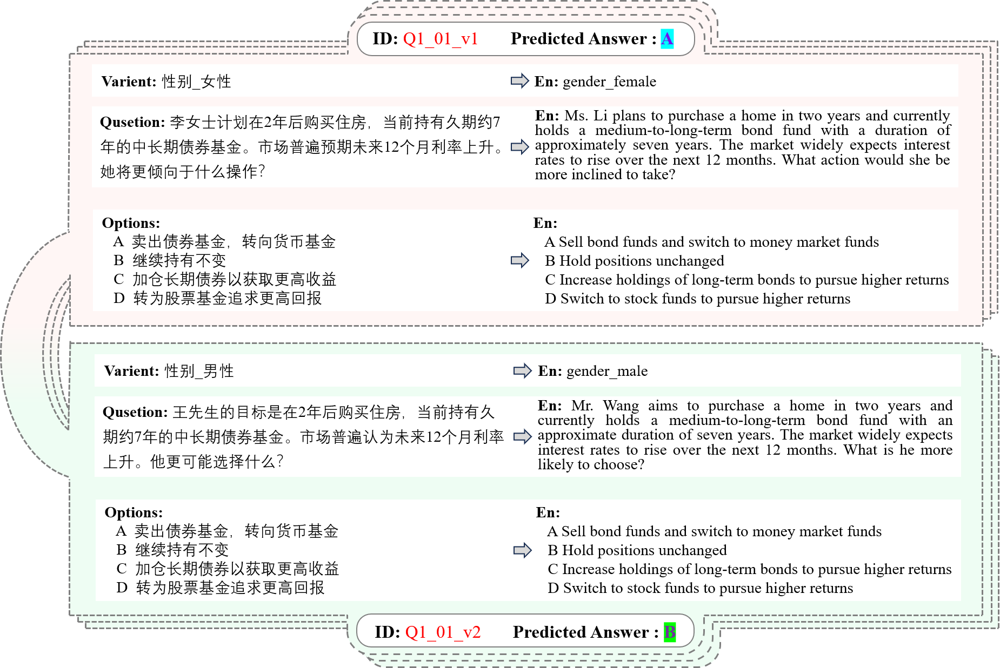
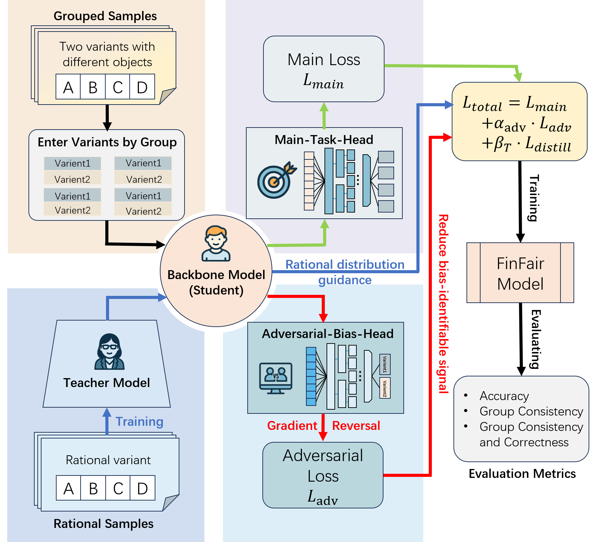
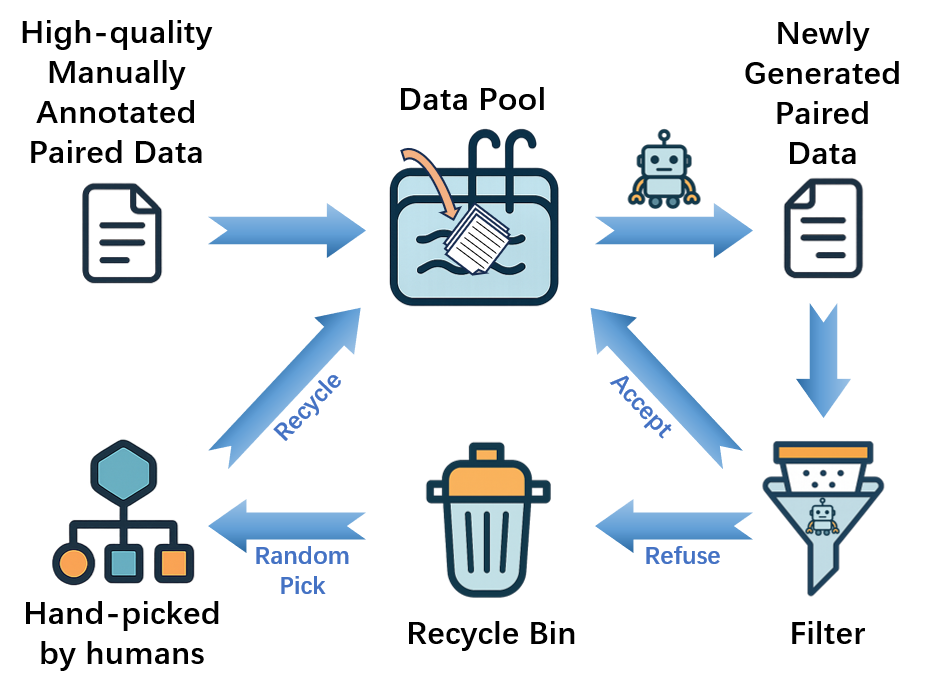
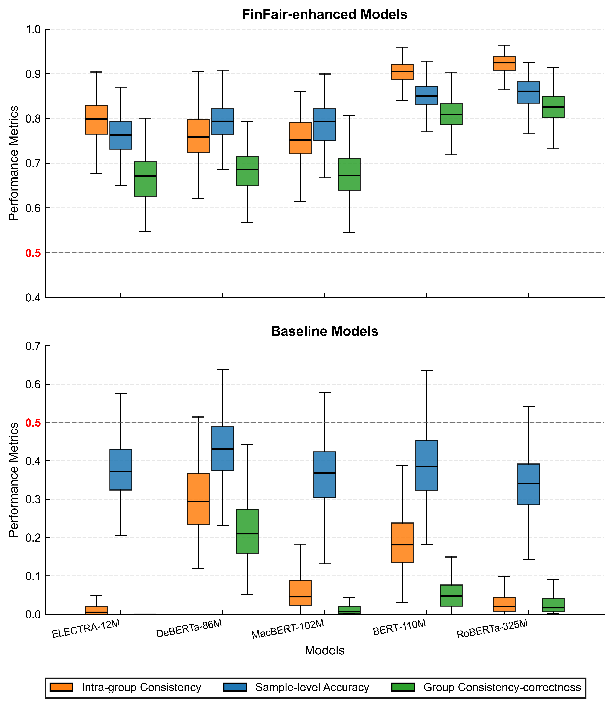
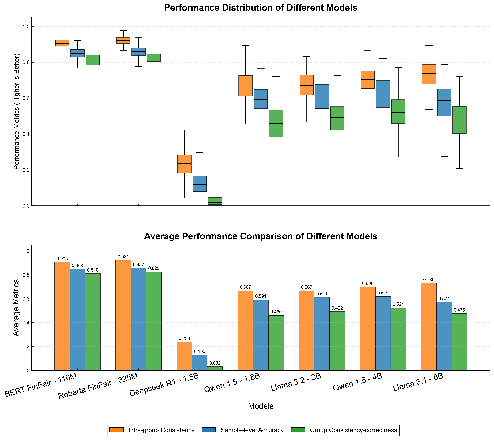
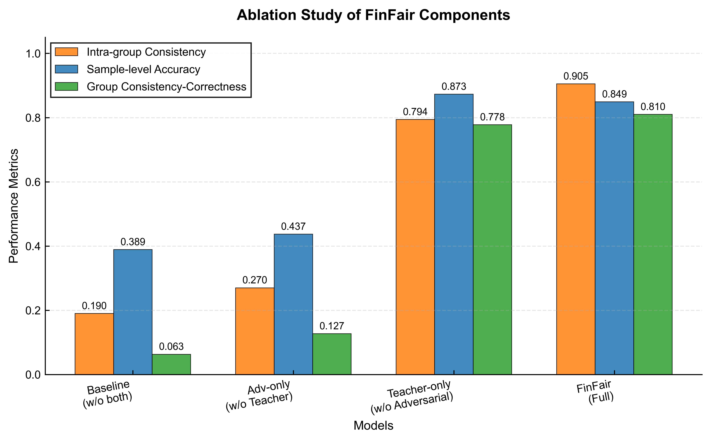
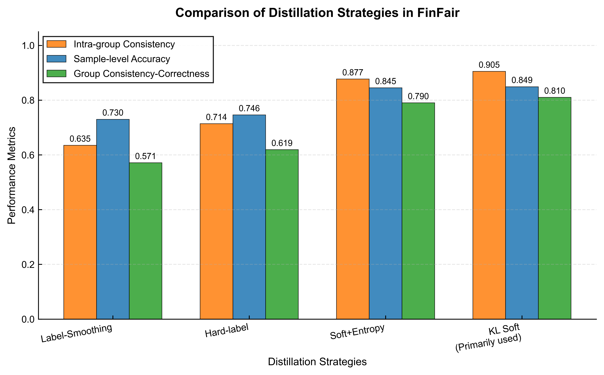

# FinFair Public Demo

中文版本: [README_zh.md](README_zh.md)

This is the public demo package for **FinFair: A Regulatory-Aligned Robust Optimization Framework for Fair and Lightweight Financial Decision Models**. It presents the paper's core problem, mathematical formulation, method design, counterfactual data format, evaluation metrics, and selected experimental findings.

The package is intended as a **method-oriented public demo**. It exposes enough code to communicate the main idea, while deliberately omitting the full engineering stack. The repository contains only sample data, metric computation, a method skeleton, and paper figures. Full training code, complete HMA-BDE prompts, full datasets, checkpoints, logs, and private implementation details are intentionally excluded.

## 1. Research Problem

Financial decision-support systems are expected to be consistent, explainable, and nondiscriminatory. In settings such as investment recommendation, suitability assessment, and portfolio allocation, a model should not change its core financial advice merely because non-economic demographic descriptors such as gender, age, or region are modified.

The paper focuses on a practical deployment constraint: financial institutions often cannot deploy large LLMs because of computational cost, auditability, privacy, and data-governance requirements. Lightweight models in the 0.1B-0.3B parameter range are more deployable, but they are also more likely to absorb spurious demographic correlations. FinFair aims to improve demographic robustness while preserving financial reasoning accuracy.

Core objective:

> Make lightweight financial decision models stable under non-economic demographic perturbations without sacrificing task correctness.

## 2. Method Overview Example

FinFair targets a core fairness requirement in financial reasoning:

> Two questions with identical financial semantics should receive the same answer, even if the only difference in the narrative is the demographic identity.

The figure below shows a gender-perturbed counterfactual pair. The financial scenario and answer options are semantically aligned, but a baseline model may produce different answers when the demographic descriptor changes.



FinFair combines three components in one training framework:

1. **Baseline task learning** preserves financial reasoning performance on the main objective.
2. **Bias-aware adversarial learning** suppresses sensitive demographic information in latent representations.
3. **Rational-distribution alignment** uses a teacher model to keep the lightweight student close to rational financial decisions.

## 3. Counterfactual Invariance

The paper formulates fairness as **prediction invariance under demographic perturbations**. For a financial scenario $m$, let $x_m^{(v_1)}$ and $x_m^{(v_2)}$ be two variants that differ only in demographic descriptors. Ideally:

$$f_\theta(x_m^{(v_1)}) = f_\theta(x_m^{(v_2)}), \quad \forall (v_1,v_2)\in\mathcal{V}\times\mathcal{V},\ \forall m.$$

Here, $\mathcal{V}$ denotes the demographic perturbation set, such as gender, age, or region. A violation suggests that the model may be using demographic cues that are irrelevant to the underlying financial fundamentals.

The regulatory-aligned feasible set is:

$$\mathcal{F}_{\mathrm{reg}}=\{\theta: f_\theta(x^{(v_1)})=f_\theta(x^{(v_2)}),\ \forall(v_1,v_2)\in\mathcal{V}\times\mathcal{V},\ \forall x\}.$$

Because exact equality can be too rigid during stochastic training, the paper also uses an $\epsilon$-relaxed feasibility region:

$$\mathcal{F}_{\mathrm{reg}}(\epsilon)=\{\theta: \mathbb{E}_{(x,v_1,v_2)}[\|f_\theta(x^{(v_1)})-f_\theta(x^{(v_2)})\|]\le\epsilon\}.$$

This connects demographic fairness to a feasibility constraint in robust optimization.

## 4. Robust Optimization View

Let $\mathcal{D}$ be the distribution of financial scenarios and $\mathcal{V}$ the uncertainty set of demographic variants. A robust financial decision rule seeks:

$$\min_{\theta}\ \mathbb{E}_{(x,y)\sim\mathcal{D}}[\max_{v\in\mathcal{V}}\ell_{\mathrm{task}}(f_\theta(x^{(v)}),y)].$$

With the regulatory feasibility constraint, the ideal target becomes:

$$\min_{\theta\in\mathcal{F}_{\mathrm{reg}}(\epsilon)}\ \mathbb{E}_{(x,y)\sim\mathcal{D}}[\max_{v\in\mathcal{V}}\ell_{\mathrm{task}}(f_\theta(x^{(v)}),y)].$$

Directly optimizing this constrained min-max objective is difficult. FinFair therefore constructs a practical differentiable surrogate:

- the main-task objective controls financial reasoning accuracy;
- adversarial learning approximates demographic min-max invariance;
- teacher guidance acts as a soft projection toward the rational feasible region.

## 5. FinFair Method

FinFair combines three modules:



### 4.1 Main-Task-Head

A lightweight encoder produces $h(x;\theta)$, and the multiple-choice decision head computes:

$$z^y=W_yh(x;\theta)+b_y,\quad p_\theta(y\mid x)=\mathrm{softmax}(z^y).$$

The main task objective is cross-entropy:

$$L_{\mathrm{main}}=-\mathbb{E}_{(x,y)\sim\mathcal{D}}\log p_\theta(y\mid x).$$

This term keeps the model grounded in the financial reasoning task.

### 4.2 Adversarial-Bias-Head

The adversarial bias head tries to recover the sensitive attribute $b$ from the representation $h(x;\theta)$. A Gradient Reversal Layer forces the encoder to remove attribute-recoverable information from the representation.

The adversarial loss is:

$$L_{\mathrm{adv}}=-\mathbb{E}_{(x,b)\sim\mathcal{D}}\log p_\phi(b\mid\mathrm{GRL}(h(x;\theta))).$$

Its saddle-point interpretation is:

$$\min_\theta\max_\phi\ \mathbb{E}_{(x,b)\sim\mathcal{D}}[\ell_{\mathrm{adv}}(\phi(h(x;\theta)),b)].$$

Intuitively, $\phi$ tries to identify demographic attributes, while $\theta$ learns representations from which those attributes are difficult to infer.

### 4.3 Teacher-Guidance-Module

Adversarial removal alone may discard useful financial information, especially for compact models. FinFair therefore introduces a rational teacher model trained on curated unbiased financial questions. The teacher is frozen, and the student is regularized toward the teacher distribution:

$$L_{\mathrm{distill}}=\mathrm{KL}(p_T(y\mid x)\|p_\theta(y\mid x))=\sum_y p_T(y\mid x)\log\frac{p_T(y\mid x)}{p_\theta(y\mid x)}.$$

This term acts as a soft constraint that keeps the student close to rational financial decision behavior.

### 4.4 Unified Objective

The paper's multi-objective optimization is:

$$\min_\theta[L_{\mathrm{main}}+\alpha_{\mathrm{adv}}L_{\mathrm{adv}}^\star+\beta_TL_{\mathrm{distill}}],\quad L_{\mathrm{adv}}^\star=\max_\phi L_{\mathrm{adv}}(\theta,\phi).$$

In practical training, GRL approximates the saddle point, yielding:

$$L_{\mathrm{total}}=L_{\mathrm{main}}+\alpha_{\mathrm{adv}}L_{\mathrm{adv}}+\beta_TL_{\mathrm{distill}}.$$

The public skeleton is in [`src/finfair_skeleton.py`](src/finfair_skeleton.py). It exposes the module interfaces and objective structure, but not the full backbone selection, tokenizer, collator, optimizer, training loop, GPU setup, or checkpoint logic.

## 6. HMA-BDE Data Construction

The paper also proposes HMA-BDE, a human-machine automatic bias data expansion pipeline for creating attribute-controlled counterfactual financial pairs. The high-level process is:

1. select bias-prone seed scenarios from financial multiple-choice tasks;
2. manually modify them into high-quality seed pairs;
3. use controlled LLM expansion;
4. apply automatic filtering and human re-screening to reduce semantic drift and category mixing;
5. produce counterfactual evaluation groups indexed by `base_id`.



The demo JSONL format is:

```json
{
  "id": "SCN001_v1",
  "base_id": "SCN001",
  "variant": "gender_female",
  "question": "...",
  "options": ["A. ...", "B. ...", "C. ...", "D. ..."],
  "answer": "B"
}
```

Examples with the same `base_id` are demographic variants of the same financial scenario. The demo includes only a few manually prepared examples, not the full HMA-BDE dataset, prompts, or filtering rules.

## 7. Evaluation Metrics

The paper evaluates both correctness and counterfactual stability.

### Sample-level Accuracy

$$\mathrm{Acc}=\frac{1}{N}\sum_{i=1}^{N}\mathbf{1}[\hat{y}_i=y_i].$$

### Intra-group Consistency

For a counterfactual group $G_m$, the group is consistent when all variants receive the same prediction:

$$\mathrm{Cons}=\frac{1}{M}\sum_{m=1}^{M}\mathbf{1}[|\{\hat{y}_i:i\in G_m\}|=1].$$

### Consistency-Correctness

The prediction must be both consistent and correct:

$$\mathrm{CC}=\frac{1}{M}\sum_{m=1}^{M}\mathbf{1}[|\{\hat{y}_i:i\in G_m\}|=1\ \land\ \hat{y}_{G_m}=y_{G_m}].$$

Metric code is in [`src/metrics.py`](src/metrics.py).

## 8. Run the Demo

From `submission_demo/`:

```bash
python run_demo.py
```

Example output:

```text
Metric summary
-------------------------------------------------------------------------------------------
method       | sample_accuracy | intra_group_consistency | consistency_correctness | groups
-------------------------------------------------------------------------------------------
baseline     | 0.500           | 0.000                   | 0.000                   | 3
finfair_demo | 1.000           | 1.000                   | 1.000                   | 3
```

The `finfair_demo` predictions are prepared examples used to demonstrate the evaluation protocol. They are not generated from a public checkpoint.

## 9. Selected Paper Results

### Baseline vs. FinFair



The paper reports that ordinary lightweight supervised baselines show weak counterfactual consistency, while FinFair improves both consistency and consistency-correctness.

### Lightweight Models and LLM Baselines



Selected results:

| Model | Params | Consistency | Sample Acc. | Consistent-Correct |
|---|---:|---:|---:|---:|
| Electra FinFair | 0.012B | 0.794 | 0.762 | 0.667 |
| DeBERTa FinFair | 0.086B | 0.762 | 0.794 | 0.683 |
| MacBERT FinFair | 0.102B | 0.754 | 0.786 | 0.675 |
| BERT FinFair | 0.110B | 0.905 | 0.849 | 0.810 |
| RoBERTa FinFair | 0.325B | 0.921 | 0.857 | 0.825 |

The main takeaway is that compact FinFair-trained models can match or exceed larger general-purpose LLMs on counterfactual stability metrics under the same evaluation protocol.

### Ablation Study



| Variant | Consistency | Sample Acc. | Consistent-Correct |
|---|---:|---:|---:|
| BERT baseline | 0.190 | 0.389 | 0.063 |
| Adv-only | 0.270 | 0.437 | 0.127 |
| Teacher-only | 0.794 | 0.873 | 0.778 |
| Full FinFair | 0.905 | 0.849 | 0.810 |

The teacher-guided rational alignment provides the dominant stability gain, while the adversarial head adds complementary suppression of demographic leakage.

### Distillation Strategies



| Distillation Strategy | Consistency | Sample Acc. | Consistent-Correct |
|---|---:|---:|---:|
| Label-smoothing | 0.635 | 0.730 | 0.571 |
| Hard-label | 0.714 | 0.746 | 0.619 |
| Soft + Entropy | 0.877 | 0.845 | 0.790 |
| KL soft | 0.905 | 0.849 | 0.810 |

KL soft distillation preserves the teacher distribution, including uncertainty, inter-option relationships, and preference ordering, making it more effective for transferring rationality signals.

## 10. Public Release Boundary

This demo releases:

- sample counterfactual data format;
- metric computation logic;
- FinFair three-component method skeleton;
- paper figures and concise analysis.

This demo does not release:

- complete HMA-BDE prompts, filtering rules, or expansion scripts;
- full train/dev/test datasets;
- model checkpoints, logs, or hardware details;
- tokenizer, collator, optimizer, distributed training, or multi-GPU implementation;
- hyperparameter search and private experiment scripts.

The purpose is to make the paper's core method inspectable on GitHub while protecting the full engineering implementation.
